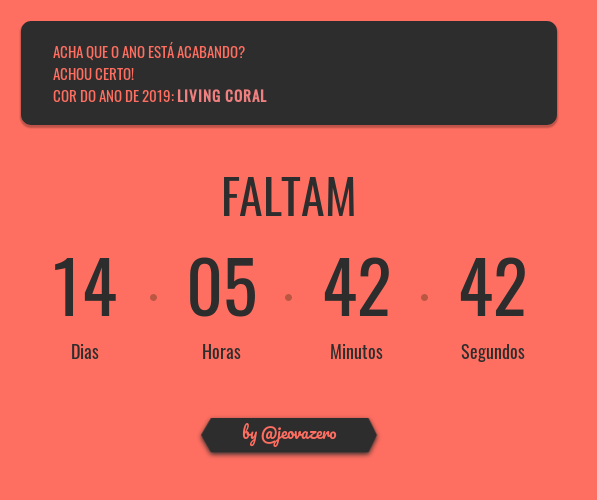

## Um Timer pro fim do periodo 2018.2 da UFPI

Pegando a hora do Google e calculando quanto falta de acordo com a data de fim.




#### Componente

```javascript
<relogin enddate="Dec 12, 2018 23:59:59"> </relogin>
```


Made with :expressionless: by <a href="https://github.com/jeovazero">@jeovazero</a>


